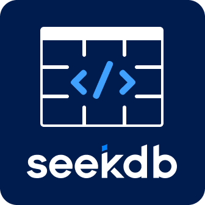

<p align="center">
  
</p>

<h1 align="center">seekdb-client</h1>

<p align="center">
  <strong>A VS Code extension for SeekDB & MySQL — database management, vector search, and safe data workflows in one place.</strong>
</p>

<p align="center">
  <a href="https://marketplace.visualstudio.com/items?itemName=alfredlau.seekdb-client"></a>
  <a href="https://marketplace.visualstudio.com/items?itemName=alfredlau.seekdb-client"></a>
  
  
  <a href="./CHANGELOG.zh-CN.md"></a>
</p>

<p align="center">
  <a href="#-quick-start">Quick Start</a> •
  <a href="#-features">Features</a> •
  <a href="#-fork-table--safe-change">Fork Table</a> •
  <a href="#%EF%B8%8F-commands">Commands</a> •
  <a href="#-configuration">Configuration</a> •
  <a href="#-contributing">Contributing</a>
</p>

---

## What is seekdb-client?

seekdb-client is a VS Code extension that brings database management directly into your editor. It is purpose-built for [SeekDB](https://www.oceanbase.ai/) — a MySQL-compatible database with native vector search — while also fully supporting standard MySQL instances.

Whether you're building AI-powered applications with semantic search, managing traditional relational data, or experimenting with schema changes safely using Fork Table, seekdb-client provides a unified workflow without leaving VS Code.

---

## 🚀 Quick Start

### Prerequisites

| Requirement | Version | Notes |
|---|---|---|
| VS Code | >= 1.96.0 | Required |
| Docker | Latest | For local SeekDB instances |
| Node.js | >= 18 | For local embedding model |

### Installation

1. **Install from Marketplace**

   Open VS Code → Extensions (`Ctrl+Shift+X`) → Search `seekdb-client` → Install

2. **Start a SeekDB instance** (if you don't have one)

   ```bash
   docker run -d --name seekdb \
     -p 2881:2881 \
     ghcr.io/oceanbase/seekdb:latest
   ```

3. **Create a connection**

   Open Command Palette (`Ctrl+Shift+P`) → `seekdb: New Connection`

   Default connection parameters (works out of the box with the Docker command above):

   | Parameter | Default |
   |---|---|
   | Host | `127.0.0.1` |
   | Port | `2881` |
   | Tenant | `sys` |
   | Database | `test` |
   | User | `root` |

4. **Start exploring** — click the SeekDB icon in the Activity Bar to browse collections, run queries, and search with vectors.

---

## ✨ Features

### 🗄️ Database Connection Management

Manage multiple SeekDB and MySQL connections from the sidebar. Connections are persisted across sessions and organized into **Cloud** and **Local** groups.

- Create, edit, test, and delete connections
- One-click connect/disconnect
- Support for OceanBase Cloud sign-in
- Auto-saved connection profiles

### 📊 Collection Browser

A full-featured data browser with a modern React-based UI.

- **Tree view** — navigate databases, collections, and tables
- **Data preview** — click any collection to instantly view its contents
- **Inline SQL editor** — write and execute queries with syntax highlighting
- **Result table** — sortable, scrollable result grid
- **Execution metrics** — query latency and row count displayed per query
- **CRUD operations** — add, edit, and delete documents or rows directly from the UI
- **Table structure visualizer** — inspect column types, indexes, and constraints

### 🔍 Vector Search

Perform semantic similarity search powered by AI embeddings — no raw vector math required.

- **Natural language queries** — search by meaning, not just keywords
- **Built-in embedding model** — runs locally, zero configuration
  - Uses `Xenova/all-MiniLM-L6-v2` via `@huggingface/transformers`
  - Model auto-downloads (~87 MB) on first use, then cached locally
- **Relevance ranking** — results sorted by cosine similarity score
- **Model info display** — shows collection model vs. search model with mismatch warnings

### 🔀 Fork Table & Safe Change

Leverage SeekDB V1.1.0's zero-copy table cloning for safe, experimental workflows. See [detailed documentation below](#-fork-table--safe-change).

- **Fork Table** — create instant, zero-cost table copies
- **Safe Change** — edit data in an isolated fork, compare diffs, then apply or discard
- **Schema Diff** — compare two tables' structures side-by-side
- **Fork Lineage** — visualize the fork relationships of any table
- **A/B Test Manager** — create multiple variants, configure each differently, benchmark queries

### 💡 Code Intelligence

Get contextual help when writing SeekDB SDK code in your editor.

- **Hover tooltips** — shows collection schema and document count when hovering over `getOrCreateCollection("name")`
- **Go to definition** — `Cmd+Click` (or `Ctrl+Click`) to open the collection in the browser
- **File support** — `.ts`, `.js`, `.tsx`, `.jsx`

### 🏥 Environment Preflight

Automatic health checks on startup to ensure your development environment is ready.

- Docker installation and daemon status
- SeekDB Docker image availability
- SeekDB instance connectivity
- Detailed diagnostic reports with actionable recommendations

### 📦 App Templates

Scaffold new applications from built-in templates.

- **Next.js + SeekDB template** — full-stack semantic search app ([view template](https://github.com/ofx-labs/nextjs-seekdb-template))
- One-click project creation from the sidebar

### 🌍 Internationalization

- Automatic locale detection from VS Code settings
- Full support for **English** and **简体中文**
- All UI text, notifications, and changelogs are localized

---

## 🔀 Fork Table & Safe Change

> Requires SeekDB >= V1.1.0

Fork Table is a zero-copy table cloning feature that creates instant copies of tables for safe experimentation.

### Fork Table (Basic Operation)

Right-click a collection → `⋯` → **Fork Table** → specify a target name.

```sql
-- What happens under the hood:
FORK TABLE `source_table` TO `target_table`;
```

The fork is an independent copy. Use it for backups, experiments, or branching data.

### Safe Change (Guided Workflow)

Right-click a collection → `⋯` → **Safe Change (Fork & Edit)**

This launches a complete edit-in-isolation workflow:

```
┌──────────────────────────────────────────────────────────────┐
│ 🛡 Safe Change Mode                                         │
│ Editing fork "docs_safe_17400..." of "documents"             │
│                          [Compare] [Apply to Source] [Discard]│
└──────────────────────────────────────────────────────────────┘
```

1. A temporary fork is created automatically
2. The UI switches to the fork — a yellow banner confirms Safe Change Mode
3. Make any changes (ALTER, INSERT, UPDATE, DELETE) freely
4. **Compare** — view schema differences between the fork and the original
5. **Apply to Source** — promote the fork to replace the original (with auto-backup)
6. **Discard** — drop the fork, leaving the original untouched

### A/B Test Manager

Right-click a collection → `⋯` → **A/B Test**

A three-step workflow for comparative testing:

| Step | Action |
|---|---|
| **1. Create** | Fork the source into N variants |
| **2. Configure** | Apply different modifications to each variant (e.g., different indexes) |
| **3. Benchmark** | Run the same query against all variants and compare performance |

### Schema Diff

Compare the structure of any two tables — see added, removed, and modified columns at a glance.

### Fork Lineage

Visualize all forks derived from a table and their relationships.

---

## ⌨️ Commands

Access via Command Palette (`Ctrl+Shift+P` / `Cmd+Shift+P`):

| Command | Description |
|---|---|
| `seekdb: New Connection` | Create a new database connection |
| `seekdb: Open Collection Browser` | Open the collection browser panel |
| `seekdb: Open Documentation` | Open SeekDB documentation |
| `seekdb: Open Settings` | Open extension settings |
| `seekdb: Fork Table` | Fork a table (zero-copy clone) |
| `seekdb: Compare Tables (Schema Diff)` | Compare two tables' schemas |
| `seekdb: Promote Fork (Replace Source)` | Replace original table with fork |
| `seekdb: Discard Fork` | Delete a forked table |
| `seekdb: 运行环境检查` | Run environment preflight checks |
| `seekdb: 查看更新日志` | View version update changelog |
| `seekdb: Create App from Template` | Scaffold a new app from a template |

---

## ⚙️ Configuration

All settings are under the `seekdb.*` namespace. Open via `Ctrl+,` and search "seekdb".

| Setting | Type | Default | Description |
|---|---|---|---|
| `seekdb.updateNotification.enabled` | `boolean` | `true` | Show changelog after extension updates |
| `seekdb.database.embedding.huggingFaceMirror` | `string` | `"china"` | HuggingFace mirror (`"china"` or `"international"`) |
| `seekdb.preflight.enabled` | `boolean` | `true` | Run environment checks on startup |
| `seekdb.preflight.showProgress` | `boolean` | `true` | Show preflight progress notifications |
| `seekdb.preflight.checkDocker` | `boolean` | `true` | Check Docker availability |
| `seekdb.preflight.checkSeekDBImage` | `boolean` | `true` | Check SeekDB Docker image |
| `seekdb.preflight.checkSeekDBInstance` | `boolean` | `true` | Check SeekDB instance health |

---

## 🏗️ Project Structure

```
seekdb-client/
├── src/                          # Extension backend (TypeScript)
│   ├── extension.ts              # Entry point
│   ├── core/                     # Extension lifecycle management
│   ├── commands/                 # Command handlers
│   ├── providers/                # Tree views, hover, database logic
│   │   ├── DatabaseProvider.ts   # Core DB operations & WebView messaging
│   │   ├── DatabaseTreeDataProvider.ts
│   │   ├── CollectionHoverProvider.ts
│   │   └── AppTreeDataProvider.ts
│   ├── services/                 # Business logic services
│   │   ├── embedding/            # Vector embedding (HuggingFace)
│   │   ├── preflight/            # Environment health checks
│   │   └── UpdateNotificationService.ts
│   ├── utils/                    # Shared utilities
│   └── views/                    # View management
├── ui/                           # Frontend (React + TypeScript + Vite)
│   └── src/
│       ├── components/           # React components
│       │   ├── CollectionBrowserPage.tsx   # Main browser UI
│       │   ├── ConnectPage.tsx             # Connection form
│       │   ├── TableStructureVisualizer/   # Schema visualization
│       │   ├── PreflightCheck/             # Environment check UI
│       │   └── DatabaseModal/              # Connection dialogs
│       └── pages/                # Page entry points
├── media/                        # Icons and images
├── scripts/                      # Build & setup scripts
├── docs/                         # Documentation
└── package.json                  # Extension manifest
```

---

## 🛠️ Development

### Setup

```bash
# Clone the repository
git clone https://github.com/ofx-labs/seekdb-client.git
cd seekdb-client

# Install all dependencies (extension + UI)
npm run install:all

# Build the UI
npm run webview:build

# Compile the extension
npm run compile
```

### Development Workflow

```bash
# Watch mode for UI changes
npm run webview:watch

# Watch mode for extension changes
npm run watch

# Build and launch in VS Code (all-in-one)
npm run dev
```

### Packaging

```bash
# Build production bundle
npm run vscode:prepublish

# Create .vsix package
npm run vscode:package
```

### Tech Stack

| Layer | Technology |
|---|---|
| Extension Host | TypeScript, VS Code Extension API |
| Frontend | React 19, TypeScript, Vite |
| Database | mysql2 (protocol), seekdb SDK |
| Embeddings | @huggingface/transformers |
| UI Components | Lucide React (icons), Custom CSS |
| Build | Vite (UI), tsc (extension) |

---

## 📖 Documentation

| Document | Description |
|---|---|
| [CHANGELOG.md](./CHANGELOG.md) | Version history (bilingual index) |
| [CHANGELOG.zh-CN.md](./CHANGELOG.zh-CN.md) | 中文更新日志 |
| [CHANGELOG.en.md](./CHANGELOG.en.md) | English changelog |
| [SeekDB Docs](https://www.oceanbase.ai/docs/) | Official SeekDB documentation |
| [SeekDB V1.1.0 Release Notes](https://www.oceanbase.ai/docs/releasenote-v1.1.0/) | Fork Table feature details |

---

## 🤝 Contributing

Contributions are welcome! Here's how you can help:

1. **Report bugs** — [Open an issue](https://github.com/ofx-labs/seekdb-client/issues) with reproduction steps
2. **Request features** — Describe your use case in a new issue
3. **Submit PRs** — Fork the repo, create a branch, and open a pull request
4. **Improve translations** — Add or fix translations for your language

### Development Prerequisites

- Node.js >= 18
- VS Code >= 1.96.0
- Docker (for testing with SeekDB instances)

---

## 📄 License

MIT

---

## 🔗 Links

- [SeekDB Official Site](https://www.oceanbase.ai/)
- [SeekDB Documentation](https://www.oceanbase.ai/docs/)
- [VS Code Marketplace](https://marketplace.visualstudio.com/items?itemName=alfredlau.seekdb-client)
- [GitHub Repository](https://github.com/ofx-labs/seekdb-client)
- [Next.js + SeekDB Template](https://github.com/ofx-labs/nextjs-seekdb-template)

---

<p align="center">
  Made with ❤️ by <a href="https://github.com/ofx-labs">ofx-labs</a>
</p>
