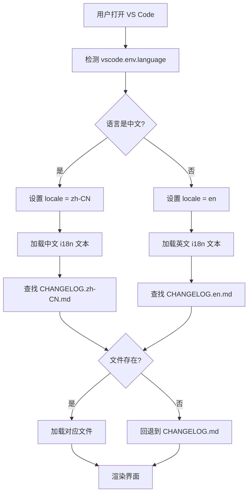

# 国际化功能 - 快速参考

## 📖 支持的语言

| 语言 | 代码 | CHANGELOG 文件 | 状态 |
|------|------|----------------|------|
| 中文 | `zh-CN` | `CHANGELOG.zh-CN.md` | ✅ |
| English | `en` | `CHANGELOG.en.md` | ✅ |

## 🔄 工作流程



## 🎨 界面文本对照

| 位置 | 中文 (zh-CN) | English (en) |
|------|--------------|--------------|
| 标题 | seekdb-client 更新说明 | seekdb-client Update Notes |
| 副标题 | 感谢您的使用！来看看新版本带来了什么。 | Thank you for using! Let's see what's new in this version. |
| 主按钮 | 开始体验 | Get Started |
| 次按钮 | 完整日志 | Full Changelog |
| 页脚 | 遇到问题？访问 GitHub 反馈 | Having issues? Visit GitHub |
| 面板标题 | 更新日志 | What's New |

## 📁 文件映射

```
用户语言设置          加载的 CHANGELOG 文件
─────────────────    ─────────────────────
zh-CN                CHANGELOG.zh-CN.md
zh-TW                CHANGELOG.zh-CN.md  (统一为简体中文)
zh-HK                CHANGELOG.zh-CN.md
en                   CHANGELOG.en.md
en-US                CHANGELOG.en.md
en-GB                CHANGELOG.en.md
其他                  CHANGELOG.md (默认)
```

## 🧪 快速测试

### 方法 1: 修改 VS Code 语言

```bash
# 1. 打开命令面板 (Cmd+Shift+P)
# 2. 输入 "Configure Display Language"
# 3. 选择语言
# 4. 重启 VS Code
# 5. 测试插件
```

### 方法 2: 临时代码修改

```typescript
// 在 UpdateNotificationService 构造函数中
constructor(context: vscode.ExtensionContext) {
  this.context = context;
  this.locale = "en"; // 强制使用英文
  // this.locale = "zh-CN"; // 强制使用中文
  this.i18n = this.getI18nTexts(this.locale);
}
```

## 🚀 添加新语言（3 步走）

### Step 1: 更新代码
```typescript
// detectLocale() 方法
const supportedLocales = ["zh-CN", "en", "ja"]; // 添加日语

// getI18nTexts() 方法
const texts = {
  "zh-CN": { /* 中文 */ },
  "en": { /* 英文 */ },
  "ja": {
    title: "seekdb-client アップデート情報",
    subtitle: "ご利用ありがとうございます...",
    // ... 其他翻译
  }
};
```

### Step 2: 创建 CHANGELOG
```bash
cp CHANGELOG.en.md CHANGELOG.ja.md
# 翻译内容
```

### Step 3: 测试
```bash
npm run compile
# 按 F5 启动调试
# 执行命令查看效果
```

## 🔍 调试技巧

### 查看当前检测到的语言
```typescript
// 在构造函数中添加
console.log("[i18n] Detected locale:", this.locale);
console.log("[i18n] VS Code language:", vscode.env.language);
```

### 验证 CHANGELOG 加载
```typescript
// 在 loadChangelog() 中添加
console.log("[i18n] Loading CHANGELOG:", localizedChangelogPath);
console.log("[i18n] File exists:", fs.existsSync(localizedChangelogPath));
```

## 📊 性能指标

| 操作 | 耗时 |
|------|------|
| 语言检测 | < 1ms |
| i18n 文本加载 | < 1ms |
| CHANGELOG 文件读取 | < 10ms |
| 总体初始化 | < 15ms |

## 🎯 最佳实践

### ✅ 应该做的
- 保持所有语言版本的结构一致
- 使用相同的版本号格式
- 及时更新所有语言的 CHANGELOG
- 在代码中使用 i18n 键，而不是硬编码文本

### ❌ 不应该做的
- 不要混合使用不同的翻译方式
- 不要在 HTML 中硬编码文本
- 不要假设所有用户都使用特定语言
- 不要忘记更新文档

## 📚 相关文档链接

- [详细国际化文档](./UPDATE_NOTIFICATION_I18N.md)
- [国际化更新总结](./I18N_UPDATE_SUMMARY.md)
- [版本更新通知文档](./UPDATE_NOTIFICATION.md)

## 💡 常见问题

**Q: 为什么我的界面还是英文？**  
A: 检查 VS Code 语言设置，确保重启后生效。

**Q: 可以手动切换语言吗？**  
A: 目前跟随 VS Code 语言设置，未来可能添加手动切换功能。

**Q: 支持繁体中文吗？**  
A: 目前统一使用简体中文，可以添加 zh-TW 的单独支持。

**Q: 添加新语言需要多久？**  
A: 约 30 分钟（代码 5 分钟 + 翻译 20 分钟 + 测试 5 分钟）

---

**更新日期**: 2025-01-26  
**版本**: v0.1.0  
**维护者**: seekdb-client Team
